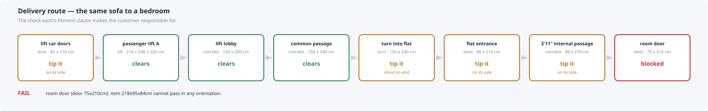
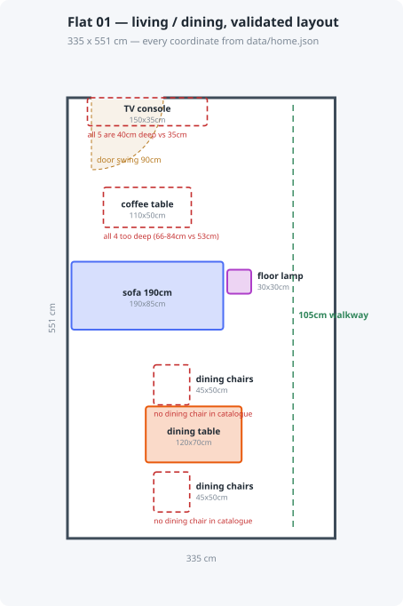

# eazli agent swarm

**[▶ Live studio](https://rppol.github.io/eazli-agent-swarm/)** — plan a room, swap
any piece, see the engine's verdict. Static replay of real `app/geometry.py`
output; run it locally with `make studio` to have the engine judge every edit live.


A working multi-agent system that implements [eazli's](https://www.eazli.com) own
published agent model — Zeina, Noura and Adam — against a real apartment floor plan and
465 real amazon.sa listings.

**The one idea:** the LLM proposes, Python verifies. No agent decides whether a sofa
fits. That is computed deterministically and handed to the agents as a fact they may not
override.

eazli already ships an "AI Floor Planner" — it is named on their
[services page](https://www.eazli.com/services). So the contribution here is not the
idea of planning a room. It is the discipline of **refusing to assert a spatial fact the
engine cannot verify**, which is the mechanism behind the one number eazli sells vendors
on: *"27%-43% reduction in returns driven by better fit"*. Their own
[AI agent terms](https://www.eazli.com/terms-ai-agent) disclaim liability for whether an
item can actually be *"delivered, moved in, installed"* through *"doorways, hallways,
stairs, and elevators"*. This system checks that instead of disclaiming it.

Every eazli figure quoted in this repo was re-fetched from the live site on 2026-08-08
by a second client and checked against the constants in `app/main.py` — see
[`kb/raw/source-verification.json`](kb/raw/source-verification.json). Nothing was
contradicted; one page renders client-side and is labelled unverified rather than
assumed.

```
Claude Code subagents        MCP shim  →   FastAPI   →   ChromaDB
  zeina-guide      intake, routing        geometry.py     eazli_kb  (78)
  noura-designer   layout slots           (deterministic, products  (465)
  adam-advisor     product sourcing       369 tests)      design_principles (13)
  fit-auditor      adversarial re-check
  eazli-judge      LLM-as-judge eval
  surveyor         floor plan → geometry
  catalog-normalizer  listing parser
```

No LLM APIs are called at runtime. Embeddings are local (`all-MiniLM-L6-v2`); all
reasoning is Claude Code subagents.

---

## Why this exists

eazli sells vendors on a **27–43% reduction in returns "driven by better fit,
visualization and expectations"**. Their AI Agent policy simultaneously disclaims liability
for whether *"an item (e.g. a sofa) cannot be delivered, moved in, installed"* through
*"doorways, hallways, stairs, and elevators"*.

This closes that gap. Two checks, deliberately separate because they fail independently:

| | question | dimensions used |
|---|---|---|
| `check_fit` | does it work **in** the room? | assembled |
| `check_access_path` | can it **get to** the room? | carton, where published |

On the real floor plan in `data/home.json`:

```
$ uv run python cli.py access unit01 living_dining 218 95 84
PASS   — "flat entrance (door 90x210cm): clears at 84x95cm — must be carried on its side."

$ uv run python cli.py access unit01 bedroom 218 95 84
FAIL   — "room door (door 75x210cm): item 218x95x84cm cannot pass in any orientation."
```

Same sofa. Different room. Only the route differs.



The layout below is rendered **from** `data/home.json` and the real product
dimensions — not drawn to illustrate them. Dashed outlines are slots the
catalogue could not fill, each carrying the measurement that ruled every
candidate out.



There is a real 3D model too — [`docs/img/room.obj`](docs/img/room.obj), metres,
Y-up, objects named by ASIN. See **[SHOWCASE.md](SHOWCASE.md)** for the
isometric view and how the agents argued their way here.

---

## Quick start

```bash
uv sync
PYTHONPATH=. uv run python ingest/build_kb.py        # 78 chunks + 6 design rules
PYTHONPATH=. uv run python ingest/build_catalog.py   # 465 amazon.sa products
uv run uvicorn app.main:app --port 8000              # docs at /docs

uv run pytest -q                                     # unit + integration
PYTHONPATH=. uv run python evals/run_evals.py        # ground-truth evals
```

Then, in Claude Code:

```
/eazli living room feels cramped, 8000 SAR, warm and minimal
```

The MCP server in `.mcp.json` is read at Claude Code startup — restart once after
cloning. Until then the agents fall back to `cli.py`, which hits the same endpoints.

---

## What's honest about it

**`dims_confidence` travels with every number** — `stated`, `parsed`, `conflicted`,
`missing`. An item with no published dimensions returns `unverified`, never `pass`.
Refusing to answer is the feature; a confident wrong answer is what produces a return.

Of 465 real listings, **210 are usable for a confirmed fit claim**. The other 255 are
kept in the index so an agent can find and dismiss them, each flagged with the reason:
contradictory, physically impossible, implausibly priced, the wrong category entirely,
or publishing no dimensions at all. Nothing is refused silently.

The usable rate *fell* as the catalogue grew — 76% at 75 listings, 45% at 465. More
choice really did mean more junk, which is why most of the parser is about refusing
things. 154 listings publish no dimensions of any kind. Real marketplace data looks like
this:

```
1.05D x 2.2W x 0.83H Meters     ← metres
104.5D x 170W x 82.5H centimeters
495 mm  /  50 Inches  /  87 Pounds
Item Dimensions D x W x H: 44D x 91W x 180H   ┐ same listing,
Item Dimensions:           79.4 x 36 x 175.5  ┘ 40cm apart
"Boho Accent Armchair" — 40 x 30 x 32 cm      ← 30cm wide armchair
"coffee table" → Philips Fully Automatic Coffee Machine
```

**Rules that don't run don't pass.** `validate_layout` originally selected rules by
substring-matching item ids, so passing ASINs silently skipped the seating and
sofa-to-table checks and returned `pass` on a broken layout. A sourcing agent found it by
using the system. Now an undeterminable role makes the layout `unverified`.

**The catalogue can furnish a room but cannot finish one.** After a layout passes, a
second geometric pass (`app/styling.py`) measures what is left over — the free wall runs
at hanging height, the empty floor pockets — and sizes a finishing piece for each from a
stated rule: hang the centre at 145 cm, span 60–75% of the furniture below, leave 75 cm
of passage. It then says, per suggestion, that the captured assortment has **no art, no
plants, no mirrors** and gives the search that would find one. The tempting version of
this feature asks a model to name a painting; that invents a product at a size nobody
measured. Naming the assortment gap is the more useful answer, and for a shopping
product it is the actual finding.

**Assumptions are surfaced, not buried.** The floor plan dimensions rooms but not ceiling
heights, door leaves or lift car heights. Those are marked `assumed` and reported
wherever a verdict depends on one.

---

## Evaluation

Split by decidability, which is the point:

**Ground truth (32 scenarios, no model involved)** — `evals/run_evals.py`. Geometry,
catalogue provenance, plan limits. Runs in CI, exits non-zero on regression.

```
access 6/6 · access_carton 2/2 · fit 3/3 · quota 3/3
catalog 9/9 · layout 6/6 · retrieval 2/2 · provenance 1/1   total 32/32
```

**LLM-as-judge (6 dimensions)** — `eazli-judge` grades only what is genuinely
qualitative: groundedness, scope discipline, calibrated honesty, usefulness, failure-mode
handling, and reasoning integrity. Evidence must be quoted before a score is given.
Presenting something unverified as confirmed caps the whole run at 2.

Asking a judge to arbitrate arithmetic is how eval suites start lying to you.

---

## Agents and their limits

Each agent's **negative** scope comes from eazli's published policy, not from taste:

| agent | may not |
|---|---|
| `zeina-guide` | name a product or propose a layout — *"she doesn't give you a catalog or a quote"* |
| `noura-designer` | choose products; assert any dimension a tool didn't return |
| `adam-advisor` | design or reposition anything — *"He does not design rooms or create visuals"* |
| `fit-auditor` | trust any verdict it did not re-run itself |
| all | complete a purchase — agents have no such authority under eazli's policy |

Workers reason in an explicit **ReAct** loop and emit it as a structured trace, so the
judge can tell load-bearing reasoning from post-hoc narration. See
[`docs/reasoning-protocol.md`](docs/reasoning-protocol.md).

---

## Layout

```
app/geometry.py     deterministic spatial engine — fit, layout, access path
app/home.py         floor plan + per-room delivery routes
app/catalog.py      amazon.sa listing parser with provenance
app/main.py         FastAPI service — the only entry point to the engine
mcp_server.py       MCP shim — typed passthrough, no logic
cli.py              CLI over the same endpoints
ingest/             KB and catalogue builders + browser capture server
evals/              ground-truth scenarios and runner
viz/render.py       plan, isometric and OBJ generated from the engine
.claude/agents/     the seven agent definitions
docs/teardown.md    product analysis of eazli
docs/demo-run.md    a full recorded swarm run
```

MCP and the CLI are both thin HTTP callers onto the same FastAPI endpoints, and
`tests/test_api.py` exercises those endpoints directly — so the three cannot disagree
about whether something fits. The geometry, catalogue and home tests import the
modules directly, which is why they could not have caught the stale-service bug.

---

## Reading order

0. [`SHOWCASE.md`](SHOWCASE.md) — **start here.** How the agents interacted, where they disagreed, and the layout drawn from the engine
1. [`docs/teardown.md`](docs/teardown.md) — the product argument
2. [`docs/demo-run.md`](docs/demo-run.md) — a real run, including the bug it found
3. [`app/geometry.py`](app/geometry.py) — the deterministic core
4. [`tests/test_geometry.py`](tests/test_geometry.py) — the contract
