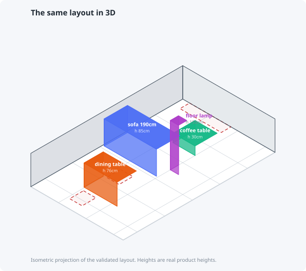
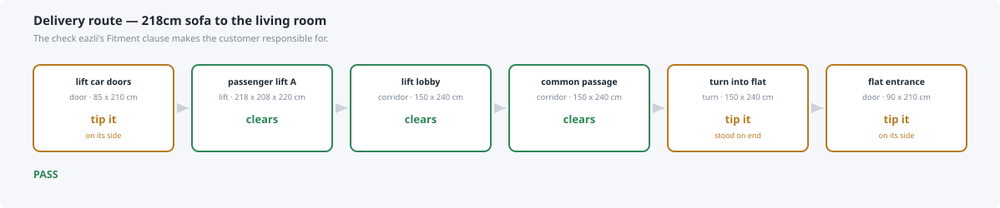

# How the agents argued their way to a correct answer

A walkthrough of the eazli agent swarm: what each agent did, where they
disagreed, how the disagreement was resolved, and what it found in its own code
along the way.

Everything below is from real runs against a real apartment floor plan and 75
real amazon.sa listings. No mocked data, no illustrative examples.

Seven agents are defined. Five appear below; `surveyor` runs once per property and
`catalog-normalizer` maintains the parser, so neither is in the request path. The
runtime swarm is three — Noura, Adam, and the auditor — plus Zeina at intake and
the judge in evaluation.

---

## The one idea

**The LLM proposes. Python verifies.**

No agent is permitted to decide whether a sofa fits. That is computed by
`app/geometry.py` — deterministic, 120-test-covered — and handed back as a fact
the agent may not override.

This is not architectural taste. eazli's AI Agent Disclaimers policy says agent
output "may be incomplete, inaccurate, or contain incorrect assumptions
('hallucinations')", and their FAQ tells users to verify **"especially for
measurements, installation, safety, or compliance"**. So measurement is removed
from the model's remit entirely.

---

## The system


**Three callers, one implementation.** The MCP shim and the CLI are thin HTTP
callers onto the same FastAPI endpoints, and `tests/test_api.py` exercises those
endpoints directly. Neither shim carries spatial logic — their only decisions are
marshalling ones — which is why they cannot drift apart about whether something
fits.

Worth being precise about the limit: the geometry, catalogue and home tests import
the modules directly rather than going over HTTP. That is why they stayed green
through the stale-service bug in Round 2, and why the canary check exists.

---

## What the agents did

```mermaid
sequenceDiagram
    autonumber
    participant U as User
    participant D as Dispatcher
    participant Z as zeina-guide
    participant N as noura-designer
    participant A as adam-advisor
    participant F as fit-auditor
    participant T as FastAPI + geometry

    U->>D: "living room feels cramped and empty,<br/>8000 SAR, warm and minimal"
    D->>Z: raw request
    Z->>T: search_eazli_kb, check_plan_quota
    T-->>Z: Explorer = 1 room / 5 layouts
    Z-->>D: brief + 2 blocking questions<br/>(no products, no layout)
    D->>U: asks the two questions
    U-->>D: budget covers everything; room empty

    D->>N: brief
    N->>T: get_room → 335 x 551 cm
    N->>T: validate_layout with probe rectangles
    T-->>N: pass
    N-->>D: 7 slots + dimension budgets<br/>(no products chosen)

    D->>A: brief + slots
    A->>T: search_products, check_fit, check_access_path
    T-->>A: 13cm sofa-table gap → fail
    Note over A,T: Adam cross-checks the API against<br/>a direct import and they disagree
    A-->>D: 4 filled, 3 unfillable,<br/>+ a bug in the tooling

    D->>F: everything
    F->>T: re-runs 14 fit, 16 access, 11 layout checks
    F-->>D: rejected — 2 blockers
```

---

## The layout, drawn from the engine

These are generated by `viz/render.py` **from** `data/home.json` and the real
product dimensions — not drawn to illustrate them. If the picture is wrong, the
layout is wrong.


Four of seven slots filled. The dashed outlines are the honest part: each
carries the reason no candidate qualified. **5,521 SAR of the 8,000 budget is
unspent — three slots the catalogue cannot fill at any price, not a room that
is cheap to furnish.**

The coffee table is there because of a finding that came *out* of this review:
the run originally reported that slot unfillable, measured against Noura's
110 x 50 cm budget. A brute-force search over the room afterwards found all four
catalogue coffee tables fit in front of the sofa. The gap was in the layout, not
the catalogue — see *Round 4* below.



Same coordinates, isometric projection, real product heights. The ghosted floor
outlines are the unfilled slots.

There is also a **real 3D model** — [`docs/img/room.obj`](docs/img/room.obj)
with [`room.mtl`](docs/img/room.mtl). Seven named objects, metres, Y-up. Open it
in Blender, macOS Preview or three.js; the furniture objects are named by their
actual ASIN.

---

## The check nobody else is doing

eazli's Fitment clause disclaims liability for whether *"an item (e.g. a sofa)
cannot be delivered, moved in, installed"* through **"doorways, hallways,
stairs, and elevators"** — while their vendor page sells a **27–43% reduction
in returns "driven by better fit, visualization and expectations"**.

So `check_access_path` walks the real route from the floor plan:




**Same sofa. Different room. Only the route differs.** It reaches the
living/dining — carried on its side through the 90 cm entrance, and stood on
end to make the corridor turn. It cannot reach a bedroom in the same flat in
any orientation.

None of that is visible from a product listing.

---

## The finding the demo didn't set out to make

Once the layouts passed, they still looked bare — which is the honest state of a room
holding a sofa, a table and a rug. The obvious fix is to ask a model for a painting. It
would name one instantly, at a size nobody measured, on a wall that might have a door in
it. That is the exact failure mode the rest of this project exists to refuse, so
finishing became geometry as well.

`app/styling.py` runs after validation and measures the leftovers:

* **Free wall runs.** A wardrobe removes the wall behind it; a sofa does not — 85 cm of
  sofa under a 145 cm hanging line is the *reason* to hang something there, so it comes
  back as the run's anchor. Doors and windows are subtracted outright.
* **Free floor pockets.** A largest-rectangle scan over a 10 cm grid, gated so a room
  that cannot give up 60 cm without dropping under a 75 cm walkway is offered nothing.
* **Sizing from a stated rule.** Centre at 145 cm, span 60–75% of the piece below. A
  214 cm sofa gets a 144 cm work; a 170 cm sofa gets 115 cm. The number moves with the
  room, which is why the four style presets produce visibly different walls.

Then the part that matters:

> **Every suggestion reports `in_catalogue: false`.**

Across 75 captured amazon.sa listings there is no wall art, no plant, no mirror. The
`accessory` category is three TV mounts, three table runners and a monitor lamp — none
with usable dimensions. So the output is a specification and a search query, not a
product.

That is a finding about the assortment, not a limitation of the demo. **A catalogue that
can furnish a room but cannot finish one will lose the second half of the basket** — and
"~19% higher AOV through smart bundles" is on eazli's own vendor page. The system can
only say so because it refused to invent the painting.


---

## The debate: should a bigger budget buy a better room?

Four budget tiers were added — 3,000 / 8,000 / 15,000 / 30,000 SAR. They did
almost nothing: `standard`, `comfort` and `premium` returned **byte-identical
plans**, so a 30,000 SAR brief produced a 3,734 SAR room. Rather than guess at
the fix, two agents with opposing incentives were asked to argue it, each told
to ground every claim in the 280-listing catalogue and to answer the other's
strongest point rather than the weakest.

### Adam: the ceiling is a bug wearing a feature's clothes

He located it in one line of `_score`:

```python
return (-matched, -evidence, product.price_sar, product.asin)
#                            ^^^^^^^^^^^^^^^^^ ascending, unsigned
```

Price appears exactly once, ascending. **No input to that tuple can ever prefer
a costlier item.** A larger budget only un-blocks candidates that were
unaffordable; it never causes an upgrade over something already reachable. That
is why `starter` differs — money is the binding constraint at 3,000 — and why
nothing above it does.

He proposed per-slot target-seeking (`abs(price - slot_target)` in place of
`price`), with headroom allocated by weight, sofa first: it is recipe priority
1, carries ~50% of the room's spend, and has the only real quality ladder in
the catalogue — linen → bouclé → velvet → air-leather, within one product line.
Not five markups of the same sofa.

### The auditor: that is how this system starts lying

It measured the thing that actually decides the question — whether evidence
survives at the top of the price range.

| band (SAR) | items | usable | no dimensions | avg reviews |
|---|---|---|---|---|
| 0 – 500 | 171 | 80 | 23 | 479.0 |
| 500 – 2,000 | 48 | 35 | 2 | 26.2 |
| 2,000 – 8,000 | 12 | 4 | 3 | 5.5 |
| 8,000 – 30,000 | 15 | 6 | 8 | 231.9 |
| 30,000+ | 23 | **1** | **19** | **0.0** |

Every listing above 30,000 SAR has zero reviews. Spearman ρ(price, reviews)
across the usable pool is **−0.33**. Growing the catalogue from 75 to 280 items
dropped usability from 76% to 45%, and the dilution is concentrated exactly
where budget headroom would send the planner.

It also found the string that would become a lie: `chose_because` hardcodes
`"cheapest that fits; no style tag or rating to go on"`, which is true only
while price sorts ascending. Flip the sort and the plan prints *cheapest that
fits* over the most expensive unrated item in the pool.

### What makes this worth showing: they converged on the same defect

Working independently, from opposite positions, both surfaced `B0DV7MZK5D` — a
39,264 SAR *"Transformer Table Solid Wood Extendable Round Dining Table Set"*
parsed as **7.6 cm tall**, `dims_confidence: stated`, **zero flags**,
`usable: True`.

The listing's own attributes say `Tabletop Thickness: 3 Inches`. The parser had
read the tabletop as the table. `_plausibility_flags` range-checks only the
single largest extent, so a mislabelled axis passes every gate — and this item
becomes the top `dining_table` pick the instant price counts for anything.

Neither agent was looking for it. One found it hunting for upgrade candidates,
the other hunting for reasons to refuse them.

### Both conceded ground

**The auditor**, asked for the strongest case against itself, produced one:
`bed` is a genuine exception. `B08569KN5F` (ZINUS platform bed, 15,385 SAR,
`stated`, 4.6★, **1,313 reviews**) is better documented than most of the cheap
end of its own category. A blanket "price is never evidence" rule refuses it
wrongly. It then named its own weakness unprompted — its guardrail *"fixes the
lying, not the disappointment"*.

**Adam** conceded the ceiling: with every verified upgrade **plus** an added
armchair, this room reaches 8,049 SAR. The catalogue cannot fill a verified
30,000 SAR living/dining room. So `premium`'s promise is nearly honest for what
is actually in stock — and **8,000 vs 15,000 is where the algorithm was really
lying to the customer.**

### The dispatcher overruled one of them on a fact

The auditor argued the 185,350 SAR coffee table (`B0FG1849P3`) was a scraping
artifact, its price lifted from Amazon's installment widget. Fetching the live
page settled it: SAR 185,350.38 sits in the core price block. It is a real
grey-market listing by a seller called `ZZZXCDSX`.

The conclusion held — that item must never be recommended — but the mechanism
was wrong, and the remedy changed with it, from a scraper patch to a
price-plausibility flag. An agent being confidently wrong about *why* is the
normal case; the value of the pattern is that the claim was checkable.

### The bug the debate's own guardrail introduced

Implementing the synthesis produced a second-order failure worth recording,
because it is the exact shape of thing a demo normally ships without noticing.

The price-plausibility flag — the auditor's own suggestion — flags anything far
above its category's median. Applied to `bed`, whose median usable price is
**332 SAR** (a market of cheap metal frames), it flagged `B08569KN5F`: a ZINUS
Brock platform bed, 15,385 SAR, 4.6 stars, **1,313 reviews**, dimensions
stated. Forty-six times the median, therefore "implausible".

That is the *precise item* the auditor had named as its own counterexample, and
the guardrail deleted it. A 30,000 SAR bedroom brief then bought a 329 SAR bed
and reported the budget as unspendable — which was false. The catalogue had
what the tier was meant to buy; the check had thrown it away.

The fix is a one-line principle: **a median multiple is only ever a proxy for
"nobody vouches for this price", and direct evidence beats a proxy.** Real
buyers at that price override the heuristic. The 185,350 SAR coffee table stays
flagged — it has zero reviews, which is the difference the flag was reaching
for all along.

Found by asking *why* the tier produced no upgrade rather than accepting that
it produced none. The measurement said "no eligible items"; the mechanism said
"one eligible item, discarded by our own new rule."

### And then the engine refused it anyway

With the flag corrected, ZINUS ranks **first** in the bedroom pool — best
evidence in the category by two orders of magnitude. The planner tries it
first, and rejects it:

```
stage: delivery
why:   turn into flat (turn 150cm into 90cm): item needs to swing 203cm of
       length around the corner but only 171cm is available at 79cm thick.
```

It is affordable. It is well reviewed. It has stated dimensions. **It fits the
room.** It cannot be carried in.

So the premium bedroom tier still buys a 329 SAR bed — but now for a reason the
system can state, about a specific corner, in centimetres. That is the whole
thesis in one rejection: the failure is not in the room, it is on the way to
the room, and no product listing on any marketplace would have told you.

### Why the premium tier still buys a cheap room — the real answer

The first explanation was "the catalogue has nothing in the middle". That was
true and it was fixed: searching Amazon's **price band** directly, rather than
by keyword, surfaced inventory relevance ranking had buried. Items priced
3,000-8,000 SAR went from 7 to 48; 8,000-15,000 went from 5 to 25; categories
with nothing in either band fell from eleven to three. The catalogue is 465
listings.

The tiers still return the same room. But the reason is now a different one,
and it is the whole point of the project.

Take `B0CC2PLFGN` — a VanAcc L-shaped sofa bed, 3,824 SAR, **800 reviews**,
4.2 stars, dimensions stated, tagged `warm`, zero flags. It clears every gate
the debate installed. Target-seeking ranks it **first**, ahead of the 1,883 SAR
sofa the standard tier picks. Then:

```
stage: delivery
why:   lift car doors (door 85x210cm): item 150x213x99cm cannot pass in
       any orientation.
```

And the bedroom's premium candidate, the ZINUS bed with 1,313 reviews:

```
stage: delivery
why:   turn into flat (turn 150cm into 90cm): item needs to swing 203cm of
       length around the corner but only 171cm is available at 79cm thick.
```

Both upgrades are affordable. Both are well reviewed. Both have published
dimensions. **Both fit their rooms.** Neither can be carried into the building.

It is not a coincidence. Across unflagged, usable, priced listings:

| | items | fail delivery |
|---|---|---|
| under 3,000 SAR | 132 | 22 (17%) |
| 3,000 SAR and up | 14 | 5 (36%) |

Small sample at the top — five of fourteen — so this is directional, not a
statistic. But the mechanism is not in doubt: dearer furniture is bigger
furniture, and the lift door is 85 cm wide no matter what you spend.

**So the premium tier is constrained by the building, not by the budget or the
assortment.** That is a sentence no marketplace can produce, because it depends
on the customer's own lift and corridor — and it is exactly the claim eazli
sells vendors on, *"27-43% reduction in returns driven by better fit"*. Their
own AI-agent terms disclaim this: liability is waived if an item cannot be
*"delivered, moved in, installed"* through *"doorways, hallways, stairs, and
elevators"*. This system checks it, refuses the sofa, and says which door.

The honest product answer is therefore not to spend more. It is to report the
ceiling and its cause — which is what `unspent_budget` does, counting rejected
candidates by reason: no published dimensions, implausible price, wrong
category, **could not be delivered**.

### What shipped

Neither position won outright, which is the point:

1. **Per-axis plausibility first.** Height and footprint are sanity-checked per
   category, not just the largest extent. A 7.6 cm dining table is flagged and
   is no longer `usable`.
2. **A price-plausibility flag**, by multiple of the category's median usable
   price — the same *flag, don't silently trust* pattern the dimension checks
   already use. Flagged items stay findable so an agent can dismiss them.
3. **Target-seeking, gated.** Budget influences ranking only for items that
   clear an evidence floor and carry no plausibility flag. Below it, price
   remains a cheapest-first tiebreaker.
4. **Narration that keeps up with scoring**, so no plan claims "cheapest that
   fits" about something deliberately upgraded.
5. **An honest ceiling.** When a budget cannot be spent, the plan reports how
   much went out and how many candidates were refused, and why.

The last one is the same move as `dims_confidence`, applied to money: the
useful answer to *"why didn't you spend my 30,000 SAR?"* is a measurement, not
a better-sounding plan.


---

## What the debate missed, and why

A fair question, asked by the person this was built for: the adversarial
auditor and the whole chain-of-thought loop were supposed to catch bad work.
So why did a bedroom ship that put an armchair flat against 180cm of shelving
and a bedside table 35cm from the bed?

It is worth answering precisely, because the reason is structural rather than
careless.

**The auditor held only the planner's own instruments.** Its tools were
`check_fit`, `check_access_path`, `validate_layout`, `get_room`. Every one of
them calls the same engine the planner had already called. Its brief said it
"independently re-verifies every spatial claim" — but *independently* meant
running the same checks a second time, not asking whether the checks were
complete. `FRONT_CLEARANCE_BY_ROLE` gave storage 0cm, so no tool it held could
form the sentence "the wardrobe cannot open". It had the authority to reject a
**plan** and no standing to reject a **rule**.

An adversary issued the defendant's own instruments inherits the defendant's
blind spots.

Two things compounded it. **The debate was scoped to a question that could not
surface it** — "should a bigger budget buy a better room?" is an economics
question, and both agents answered it well; neither was asked whether anyone
could live in the result. And **the entire loop was numeric.** Nothing in it
ever looked at the render. The defect was invisible in the data unless you knew
to ask, and obvious in about two seconds from a screenshot.

The judge did not save it either: its rubric scores groundedness, scope
discipline and calibrated honesty. None of those is *fitness for purpose*.

### What changed

Not more debate. The auditor now has `Read` and `Grep`, an instruction to open
`app/geometry.py` and read the rule table itself, and one question no tool
asks:

> Would a person be able to use this room? Open the wardrobe. Get into the bed.
> Reach the lamp from the chair. Pull out a dining chair. If any of those is
> impossible in a layout that returned `pass`, you have found a missing rule.

A missing rule is now a more serious finding than a failed plan, and it has its
own output type: **RULE GAP**, requiring the passing arrangement, the
coordinates, what a person cannot do, and the threshold that would catch it.
The brief carries the bedroom that got through, as the worked example.

The general lesson is worth more than the three rules it produced.
**"Every check passed" is a statement about the checks.** An adversarial
reviewer that can only re-run existing tests is a regression suite with
opinions; to be adversarial it has to be able to attack the test set. And a
verification loop that never renders its own output will keep missing whatever
is only visible.

---

## Where the agents disagreed

This is the part worth reading. Three reviewers ran against the system and they
did not agree with each other.

### Round 1 — Adam finds a bug in the tooling

While sourcing products, `adam-advisor` reported something nobody asked him to
look for:

> **`validate_layout` silently skipped its own rules** when passed bare ASINs as
> item ids, returning a false `pass` on his first run.

Rules were selected by substring-matching `item_id` for `"sofa"` / `"table"` /
`"chair"`. Real callers pass SKUs. `B0FR3WVLTS` matches nothing, so the seating
walkway rule and the 40 cm sofa-to-table rule **never ran**, and a layout with a
13 cm gap came back clean.

A validator that silently skips its own checks is the exact confidence
laundering the auditor exists to catch — found by *using* the system, not by
testing it.

**Fixed:** `Placement` carries an explicit `role`. An undeterminable role makes
the layout `unverified`, never `pass`. A rule that did not run has not been
passed.

### Round 2 — the auditor catches the fix not being live

`fit-auditor` then produced the finding that invalidated the entire run:

> **LIVE service, bare ASINs, no roles:** `{"status": "pass"}`
> **Same input against current code in-process:** `{"status": "unverified", ...}`
> `ps` → pid 37708 started 23:50:03; `app/geometry.py` mtime 00:16:01; no `--reload`.

The fix was in source, in the tests, and committed. The **running uvicorn was a
pre-fix build**, and any `role` sent over HTTP was silently discarded. Every
layout verdict in the run had been produced by the exact validator the run
believed it had fixed.

> *"Right answer, broken evidence chain."*

`/eazli` now opens with a canary: a layout with no roles must return
`unverified`. If it says `pass`, the process is stale.

### Round 3 — Adam contradicts the auditor, and wins

The auditor concluded a dining table slot was over-constrained. Adam, re-running
afterwards, disagreed and traced it further:

> **`FitRequest` has no `role` field**, so `/fit/check` applies the 90 cm
> *seating* walkway rule to dining tables and consoles. This is why the last run
> wrongly concluded Noura's 80 cm dining depth was impossible and rejected the
> catalogue's best-reviewed table. **Her slot budget was correct.**

Both endpoints were wrong in different directions, and the disagreement forced
the actual design question: *a dining table does not need a circulation walkway
behind it — it needs chair pull-out room.*

```python
FRONT_CLEARANCE_BY_ROLE = {
    **{r: 90 for r in SEATING_ROLES},   # a real route runs past a sofa
    **{r: 75 for r in TABLE_ROLES},     # chair pull-out, not a walkway
    **{r: 0  for r in WALL_ROLES},      # a console lives against the wall
}
```

Both endpoints now resolve clearance through that one table, so they cannot
disagree about the same item again.

**Neither reviewer alone would have found this.** The auditor had a wrong
conclusion from a correct measurement; Adam had the root cause. It took the
conflict.

### Round 4 — reviewing the *result*, not the steps

Every agent behaved correctly and the answer was still worse than it needed to be.

Adam reported the coffee-table slot unfillable. He measured it against Noura's
110 x 50 cm budget, which is what a sourcing agent should do. A brute-force
search over every position in the room, run afterwards, found **all four
catalogue coffee tables fit in front of the sofa** — the cheapest at 799 SAR,
50 cm clear of the sofa front.

Noura cut a slot tighter than the room required. Adam correctly refused to widen
someone else's slot. **Neither made a mistake, and the user was still told the
catalogue had failed them.** The defect was a missing edge: nothing sent an
unfillable slot back to the designer.

That search also exposed a gap in the engine. Three of the "valid" positions it
found were *behind* the sofa — legal under every clearance rule and useless as
furniture. The 40 cm rule only fires when a sofa and table are too **close**; two
metres apart, nothing complained. Constraints are not function, so there is now a
reach rule, and the `/eazli` dispatcher has a re-plan loop.

The lesson generalises past this project: **reviewing each agent's behaviour is
not the same as reviewing the output.** Four reviewers checked the steps and
scored them well. It took measuring the end result to find that the answer was
pessimistic by a whole piece of furniture.

---

## Chain of thought, made auditable

Workers reason in an explicit **ReAct** loop — *Thought → Action → Observation →
Reflection* — and emit it as structured data. The trace is not decoration; it is
what lets the judge tell load-bearing reasoning from narration written after the
fact. See [`docs/reasoning-protocol.md`](docs/reasoning-protocol.md).

The rule that makes it work: **state the prediction before acting.** A thought
written after seeing the result is a caption, not a thought.

Here is the moment Adam's instrument broke, verbatim from his trace:

> **step 9 — thought:** *"…I am also running a deliberate control — the south
> dining chairs facing S instead of N, which should leave 33cm to the south wall
> against the 90cm walkway rule and must fail."*
>
> **observation:** *"Every single call returned `{"status": "pass"}` — including
> the control that should have failed on 33cm."*
>
> **reflection:** *"The control passing is decisive. A layout I constructed
> specifically to violate the walkway rule came back clean, so the validator is
> NOT enforcing and every 'pass' I have collected is worthless… My instrument is
> lying to me."* — `revised: true`

A deliberately-failing control is what caught it. Nothing about the products
would have.

And the moment he corrected his own mental model:

> **step 7 — reflection:** *"WRONG, and this corrects a real misconception in
> how I was working. `check_fit` takes no slot argument — it tests the raw room,
> not Noura's budget… any rejection I write on slot grounds is my arithmetic,
> not a tool verdict. I must label those two kinds of rejection differently."*

That distinction — between *the tool said no* and *I did the arithmetic* — is
exactly the difference between grounded and ungrounded, and he drew it himself.

---

## The judge

`eazli-judge` scores completed runs on six dimensions, evidence required before
any number. It re-verifies factual claims against the live tools rather than
taking the transcript's word.

It scored the first run **3.2 / 5 — `revise`**:

| dimension | score |
|---|---|
| Scope discipline | 5 |
| Groundedness | 4 |
| Calibrated honesty | 3 |
| Failure-mode handling | 3 |
| Usefulness | 2 |
| Reasoning integrity | 2 |

It caught a dishonesty in the transcript that I had introduced — three slots
appeared dropped because I omitted from the write-up that Adam had been scoped
to four. And its closing line is the best one-sentence argument for the whole
reasoning protocol:

> *"This run was right, and the document cannot show that it was right."*

The judge is deliberately kept away from anything decidable. Geometry,
catalogue provenance and plan limits are graded by **30 ground-truth scenarios
with no model in the loop**. Asking a judge to arbitrate arithmetic is how eval
suites start lying to you.

```
access 6/6 · access_carton 2/2 · fit 3/3 · quota 3/3
catalog 9/9 · layout 4/4 · retrieval 2/2 · provenance 1/1     30/30
```

---

## FastAPI and MCP

The MCP shim carries no spatial logic — every verdict comes from the endpoint,
and its only decisions are marshalling ones:

```python
@mcp.tool()
def check_access_path(unit, room, width_cm, depth_cm, height_cm,
                      carton_width_cm=0, ...) -> str:
    """Check whether the item can physically GET to the room.
    ...
    Always pass carton dimensions when the listing gives them. A flat-packed
    item travels as panels, and judging it on assembled size rejects deliveries
    that would arrive fine.
    """
    return _call("POST", "/access/check", payload)
```

Every tool is a passthrough to an endpoint that already owns the logic and
already has tests. (The elided body assembles the payload and decides whether a
carton was supplied — the one judgement the shim makes, and it is about
marshalling, not geometry.) A test in `tests/test_mcp.py` enforces that each tool
description is substantial enough for an agent to *choose* on — it failed twice
during development and both times the fix was a better description, not a lower
bar.

Two things the API does that most wouldn't:

**It distinguishes carton from assembled.** `check_fit` uses assembled
dimensions; `check_access_path` uses carton where published. Use the wrong one
and you are confidently wrong in opposite directions — a flat-pack wardrobe
rejected for a hallway it would sail through, a rigid sofa waved through a door
it cannot clear.

**It refuses to answer.** `dims_confidence` travels with every number
(`stated` / `parsed` / `conflicted` / `missing`). Of 465 real listings only 211
are usable for a confirmed fit claim. The other 18 stay in the index so an agent
can find and dismiss them:

```
1.05D x 2.2W x 0.83H Meters          ← metres
104.5D x 170W x 82.5H centimeters    ← same catalogue, centimetres
495 mm  ·  50 Inches  ·  87 Pounds

Item Dimensions D x W x H: 44D x 91W x 180H   ┐ one listing,
Item Dimensions:           79.4 x 36 x 175.5  ┘ 40cm apart

"Boho Accent Armchair" — 40 x 30 x 32 cm      ← 30cm wide armchair
"coffee table" → Philips Fully Automatic Coffee Machine
```

---

## How it was built

| | |
|---|---|
| **Research** | 55 FAQ answers extracted (they lazy-render — `curl` returns exactly one), plus the AI Agent Disclaimers policy that defines every agent's limits |
| **Geometry first** | `check_fit`, `validate_layout`, `check_access_path` written test-first, before any agent existed |
| **Floor plan** | A real whole-floor plate, cropped per unit and transcribed; the `1.50M WIDE PASSAGE`, the `2'11"` internal passage and the `LIFT 7'2" x 6'10"` annotations are what make the access check real |
| **Catalogue** | 465 amazon.sa listings over four passes — browser session, then server-side, then price-band filtered to reach inventory keyword search buried. Kept verbatim so the parser is testable without re-scraping |
| **Agents** | Seven, each with a *negative* scope taken from eazli's published policy |
| **Review** | An adversarial auditor, an LLM judge and a code review found **14 defects**; all fixed and regression-tested |

**120 tests · 32 ground-truth evals · CI green**

The defects were almost all one shape — a check that silently did not run:

- the walkway rule measured only to walls, so two sofas **3 cm apart** passed
- the door-swing rule had **never executed once**: every room was built with `doors=[]` while the API advertised the check
- `Dims.known` tested only `is not None`, so **NaN, negative and zero** dimensions were "known" and every comparison against them was `False`
- `_combine([])` returned `"pass"`, so an empty route was a clean bill of health
- `"inches; 55 kg"` matched `kg`, found no conversion, fell back to ×1.0 and recorded a **203 cm wardrobe as 80 cm tall**, marked `stated`
- a missing axis became `0.0`, so a **sofa with no depth** cleared every door on the route

---

## Reading order

1. [`docs/teardown.md`](docs/teardown.md) — the product argument
2. [`docs/demo-run.md`](docs/demo-run.md) — the full run, including the judge scoring it
3. [`app/geometry.py`](app/geometry.py) — the deterministic core
4. [`tests/test_geometry.py`](tests/test_geometry.py) — the contract

```bash
uv sync && make index && make serve   # then, in another shell:
make demo
make check                            # 120 tests + 32 evals
```
