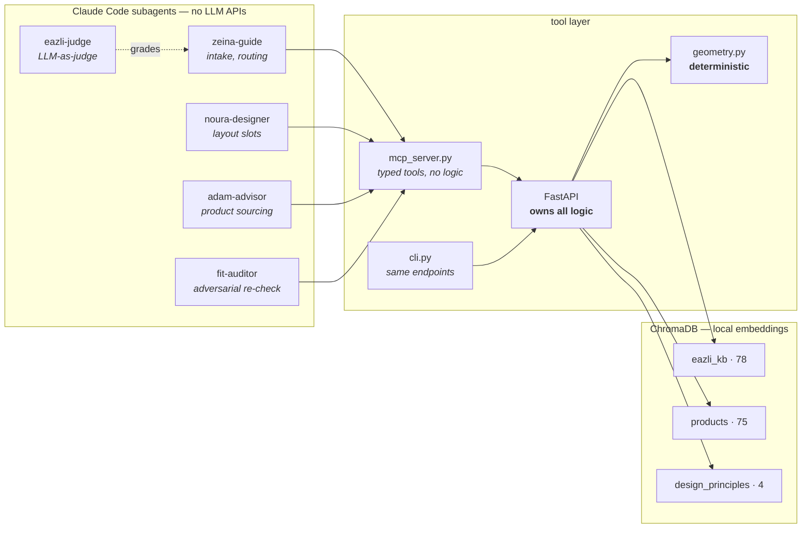

# How five agents argued their way to a correct answer

A walkthrough of the eazli agent swarm: what each agent did, where they
disagreed, how the disagreement was resolved, and what it found in its own code
along the way.

Everything below is from real runs against a real apartment floor plan and 75
real amazon.sa listings. No mocked data, no illustrative examples.

---

## The one idea

**The LLM proposes. Python verifies.**

No agent is permitted to decide whether a sofa fits. That is computed by
`app/geometry.py` — deterministic, 100-test-covered — and handed back as a fact
the agent may not override.

This is not architectural taste. eazli's own AI Agent Disclaimers policy says
agent output "may be incomplete, inaccurate, or contain incorrect assumptions
('hallucinations')" and tells users to verify **"especially for measurements"**.
So measurement is removed from the model's remit entirely.

---

## The system



**Three callers, one implementation.** The MCP shim, the CLI and the test suite
all reach the same FastAPI endpoints. The shim holds no business logic
whatsoever — which is the only reason they cannot drift apart and disagree about
whether something fits.

---

## What the agents did

```mermaid
sequenceDiagram
    autonumber
    participant U as User
    participant D as Dispatcher
    participant Z as zeina-guide
    participant N as noura-designer
    participant A as adam-advisor
    participant F as fit-auditor
    participant T as FastAPI + geometry

    U->>D: "living room feels cramped and empty,<br/>8000 SAR, warm and minimal"
    D->>Z: raw request
    Z->>T: search_eazli_kb, check_plan_quota
    T-->>Z: Explorer = 1 room / 5 layouts
    Z-->>D: brief + 2 blocking questions<br/>(no products, no layout)
    D->>U: asks the two questions
    U-->>D: budget covers everything; room empty

    D->>N: brief
    N->>T: get_room → 335 x 551 cm
    N->>T: validate_layout with probe rectangles
    T-->>N: pass
    N-->>D: 7 slots + dimension budgets<br/>(no products chosen)

    D->>A: brief + slots
    A->>T: search_products, check_fit, check_access_path
    T-->>A: 13cm sofa-table gap → fail
    Note over A,T: Adam cross-checks the API against<br/>a direct import and they disagree
    A-->>D: 3 filled, 4 unfillable,<br/>+ a bug in the tooling

    D->>F: everything
    F->>T: re-runs 14 fit, 16 access, 11 layout checks
    F-->>D: rejected — 2 blockers
```

---

## The layout, drawn from the engine

These are generated by `viz/render.py` **from** `data/home.json` and the real
product dimensions — not drawn to illustrate them. If the picture is wrong, the
layout is wrong.


Three of seven slots filled. The dashed outlines are the honest part: each
carries the measurement that ruled every candidate out. **6,320 SAR of the
8,000 budget is unspent — because the catalogue cannot fill those slots at any
price, not because the room is cheap to furnish.**


Same coordinates, isometric projection, real product heights. The ghosted floor
outlines are the unfilled slots.

There is also a **real 3D model** — [`docs/img/room.obj`](docs/img/room.obj)
with [`room.mtl`](docs/img/room.mtl). Six named objects, metres, Y-up. Open it
in Blender, macOS Preview or three.js; the furniture objects are named by their
actual ASIN.

---

## The check nobody else is doing

eazli's Fitment clause disclaims liability for whether *"an item (e.g. a sofa)
cannot be delivered, moved in, installed"* through **"doorways, hallways,
stairs, and elevators"** — while their vendor page sells a **27–43% reduction
in returns "driven by better fit"**.

So `check_access_path` walks the real route from the floor plan:


**Same sofa. Different room. Only the route differs.** It reaches the
living/dining — carried on its side through the 90 cm entrance, and stood on
end to make the corridor turn. It cannot reach a bedroom in the same flat in
any orientation.

None of that is visible from a product listing.

---

## Where the agents disagreed

This is the part worth reading. Three reviewers ran against the system and they
did not agree with each other.

### Round 1 — Adam finds a bug in the tooling

While sourcing products, `adam-advisor` reported something nobody asked him to
look for:

> **`validate_layout` silently skipped its own rules** when passed bare ASINs as
> item ids, returning a false `pass` on his first run.

Rules were selected by substring-matching `item_id` for `"sofa"` / `"table"` /
`"chair"`. Real callers pass SKUs. `B0FR3WVLTS` matches nothing, so the seating
walkway rule and the 40 cm sofa-to-table rule **never ran**, and a layout with a
13 cm gap came back clean.

A validator that silently skips its own checks is the exact confidence
laundering the auditor exists to catch — found by *using* the system, not by
testing it.

**Fixed:** `Placement` carries an explicit `role`. An undeterminable role makes
the layout `unverified`, never `pass`. A rule that did not run has not been
passed.

### Round 2 — the auditor catches the fix not being live

`fit-auditor` then produced the finding that invalidated the entire run:

> **LIVE service, bare ASINs, no roles:** `{"status": "pass"}`
> **Same input against current code in-process:** `{"status": "unverified", ...}`
> `ps` → pid 37708 started 23:50:03; `app/geometry.py` mtime 00:16:01; no `--reload`.

The fix was in source, in the tests, and committed. The **running uvicorn was a
pre-fix build**, and any `role` sent over HTTP was silently discarded. Every
layout verdict in the run had been produced by the exact validator the run
believed it had fixed.

> *"Right answer, broken evidence chain."*

`/eazli` now opens with a canary: a layout with no roles must return
`unverified`. If it says `pass`, the process is stale.

### Round 3 — Adam contradicts the auditor, and wins

The auditor concluded a dining table slot was over-constrained. Adam, re-running
afterwards, disagreed and traced it further:

> **`FitRequest` has no `role` field**, so `/fit/check` applies the 90 cm
> *seating* walkway rule to dining tables and consoles. This is why the last run
> wrongly concluded Noura's 80 cm dining depth was impossible and rejected the
> catalogue's best-reviewed table. **Her slot budget was correct.**

Both endpoints were wrong in different directions, and the disagreement forced
the actual design question: *a dining table does not need a circulation walkway
behind it — it needs chair pull-out room.*

```python
FRONT_CLEARANCE_BY_ROLE = {
    **{r: 90 for r in SEATING_ROLES},   # a real route runs past a sofa
    **{r: 75 for r in TABLE_ROLES},     # chair pull-out, not a walkway
    **{r: 0  for r in WALL_ROLES},      # a console lives against the wall
}
```

Both endpoints now resolve clearance through that one table, so they cannot
disagree about the same item again.

**Neither reviewer alone would have found this.** The auditor had a wrong
conclusion from a correct measurement; Adam had the root cause. It took the
conflict.

---

## Chain of thought, made auditable

Workers reason in an explicit **ReAct** loop — *Thought → Action → Observation →
Reflection* — and emit it as structured data. The trace is not decoration; it is
what lets the judge tell load-bearing reasoning from narration written after the
fact. See [`docs/reasoning-protocol.md`](docs/reasoning-protocol.md).

The rule that makes it work: **state the prediction before acting.** A thought
written after seeing the result is a caption, not a thought.

Here is the moment Adam's instrument broke, verbatim from his trace:

> **step 9 — thought:** *"…I am also running a deliberate control — the south
> dining chairs facing S instead of N, which should leave 33cm to the south wall
> against the 90cm walkway rule and must fail."*
>
> **observation:** *"Every single call returned `{"status": "pass"}` — including
> the control that should have failed on 33cm."*
>
> **reflection:** *"The control passing is decisive. A layout I constructed
> specifically to violate the walkway rule came back clean, so the validator is
> NOT enforcing and every 'pass' I have collected is worthless… My instrument is
> lying to me."* — `revised: true`

A deliberately-failing control is what caught it. Nothing about the products
would have.

And the moment he corrected his own mental model:

> **step 7 — reflection:** *"WRONG, and this corrects a real misconception in
> how I was working. `check_fit` takes no slot argument — it tests the raw room,
> not Noura's budget… any rejection I write on slot grounds is my arithmetic,
> not a tool verdict. I must label those two kinds of rejection differently."*

That distinction — between *the tool said no* and *I did the arithmetic* — is
exactly the difference between grounded and ungrounded, and he drew it himself.

---

## The judge

`eazli-judge` scores completed runs on six dimensions, evidence required before
any number. It re-verifies factual claims against the live tools rather than
taking the transcript's word.

It scored the first run **3.2 / 5 — `revise`**:

| dimension | score |
|---|---|
| Scope discipline | 5 |
| Groundedness | 4 |
| Calibrated honesty | 3 |
| Failure-mode handling | 3 |
| Usefulness | 2 |
| Reasoning integrity | 2 |

It caught a dishonesty in the transcript that I had introduced — three slots
appeared dropped because I omitted from the write-up that Adam had been scoped
to four. And its closing line is the best one-sentence argument for the whole
reasoning protocol:

> *"This run was right, and the document cannot show that it was right."*

The judge is deliberately kept away from anything decidable. Geometry,
catalogue provenance and plan limits are graded by **30 ground-truth scenarios
with no model in the loop**. Asking a judge to arbitrate arithmetic is how eval
suites start lying to you.

```
access 6/6 · access_carton 2/2 · fit 3/3 · quota 3/3
catalog 9/9 · layout 4/4 · retrieval 2/2 · provenance 1/1     30/30
```

---

## FastAPI and MCP

The MCP shim is deliberately, aggressively thin:

```python
@mcp.tool()
def check_access_path(unit, room, width_cm, depth_cm, height_cm,
                      carton_width_cm=0, ...) -> str:
    """Check whether the item can physically GET to the room.
    ...
    Always pass carton dimensions when the listing gives them. A flat-packed
    item travels as panels, and judging it on assembled size rejects deliveries
    that would arrive fine.
    """
    return _call("POST", "/access/check", payload)
```

Every tool is a passthrough to an endpoint that already owns the logic and
already has tests. A test in `tests/test_mcp.py` enforces that each tool
description is substantial enough for an agent to *choose* on — it failed twice
during development and both times the fix was a better description, not a lower
bar.

Two things the API does that most wouldn't:

**It distinguishes carton from assembled.** `check_fit` uses assembled
dimensions; `check_access_path` uses carton where published. Use the wrong one
and you are confidently wrong in opposite directions — a flat-pack wardrobe
rejected for a hallway it would sail through, a rigid sofa waved through a door
it cannot clear.

**It refuses to answer.** `dims_confidence` travels with every number
(`stated` / `parsed` / `conflicted` / `missing`). Of 75 real listings only 57
are usable for a confirmed fit claim. The other 18 stay in the index so an agent
can find and dismiss them:

```
1.05D x 2.2W x 0.83H Meters          ← metres
104.5D x 170W x 82.5H centimeters    ← same catalogue, centimetres
495 mm  ·  50 Inches  ·  87 Pounds

Item Dimensions D x W x H: 44D x 91W x 180H   ┐ one listing,
Item Dimensions:           79.4 x 36 x 175.5  ┘ 40cm apart

"Boho Accent Armchair" — 40 x 30 x 32 cm      ← 30cm wide armchair
"coffee table" → Philips Fully Automatic Coffee Machine
```

---

## How it was built

| | |
|---|---|
| **Research** | 55 FAQ answers extracted (they lazy-render — `curl` returns exactly one), plus the AI Agent Disclaimers policy that defines every agent's limits |
| **Geometry first** | `check_fit`, `validate_layout`, `check_access_path` written test-first, before any agent existed |
| **Floor plan** | A real whole-floor plate, cropped per unit and transcribed; the `2'11" WIDE PASSAGE` and `LIFT 7'2" x 6'10"` annotations are what make the access check real |
| **Catalogue** | 75 amazon.sa listings pulled through a real browser session, kept verbatim so the parser is testable without re-scraping |
| **Agents** | Seven, each with a *negative* scope taken from eazli's published policy |
| **Review** | An adversarial auditor, an LLM judge and a code review found **14 defects**; all fixed and regression-tested |

**100 tests · 30 ground-truth evals · CI green**

The defects were almost all one shape — a check that silently did not run:

- the walkway rule measured only to walls, so two sofas **3 cm apart** passed
- the door-swing rule had **never executed once**: every room was built with `doors=[]` while the API advertised the check
- `Dims.known` tested only `is not None`, so **NaN, negative and zero** dimensions were "known" and every comparison against them was `False`
- `_combine([])` returned `"pass"`, so an empty route was a clean bill of health
- `"inches; 55 kg"` matched `kg`, found no conversion, fell back to ×1.0 and recorded a **203 cm wardrobe as 80 cm tall**, marked `stated`
- a missing axis became `0.0`, so a **sofa with no depth** cleared every door on the route

---

## Reading order

1. [`docs/teardown.md`](docs/teardown.md) — the product argument
2. [`docs/demo-run.md`](docs/demo-run.md) — the full run, including the judge scoring it
3. [`app/geometry.py`](app/geometry.py) — the deterministic core
4. [`tests/test_geometry.py`](tests/test_geometry.py) — the contract

```bash
uv sync && make index && make serve   # then, in another shell:
make demo
make check                            # 100 tests + 30 evals
```
